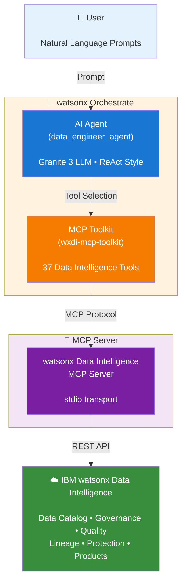

# Data Engineer Agent with watsonx Orchestrate

AI agent built with **IBM watsonx Orchestrate** integrating the **IBM watsonx Data Intelligence MCP Server**. Covers data asset search, data products, protection rules, data quality, lineage, metadata enrichment, and text-to-SQL.

---

## Architecture



**Key Components:**

- **User**: Interacts with natural language prompts for data engineering tasks
- **watsonx Orchestrate**: Hosts the AI agent with 37 specialized data intelligence tools
- **MCP Server**: Bridges the agent toolkit to the Data Intelligence platform
- **watsonx Data Intelligence**: Enterprise data governance and intelligence platform (SaaS/CPD)

---

## Prerequisites

| Requirement | Version |
|---|---|
| Python | ≥ 3.11, < 3.14 |
| [uv](https://docs.astral.sh/uv/getting-started/installation/) | latest |
| IBM watsonx Orchestrate (Developer Edition or SaaS) | latest |
| IBM watsonx Data Intelligence | SaaS or CPD ≥ 5.2.1 |

---

## Project Structure

```
.
├── agent-data-engineer.yaml   # Agent definition (name: data_engineer_agent)
├── toolkit-wxdi.yaml          # MCP toolkit spec (37 tools)
├── .env.example               # Environment variable template
├── pyproject.toml             # Python project / dependency config
└── README.md
```

---

## Quick Start

```bash
# 1. Install dependencies
uv sync

# 2. Configure credentials
cp .env.example .env   # fill in DI_APIKEY, DI_SERVICE_URL, DI_ENV_MODE, etc.

# 3. Add and activate environment
uv run orchestrate env add --name wxo-saas \
  --url "https://api.us-south.watson-orchestrate.cloud.ibm.com/instances/<instance-id>" \
  --type mcsp
uv run orchestrate env activate wxo-saas

# 4. Import the MCP toolkit
uv run orchestrate toolkits import --file toolkit-wxdi.yaml

# 5. Import the agent
uv run orchestrate agents import --file agent-data-engineer.yaml
```

---

## `toolkits import` vs `toolkits add`

| | `toolkits import` | `toolkits add` |
|---|---|---|
| **Input** | `--file <yaml>` spec file | CLI flags only |
| **STDIO MCP** | reads `command:` from YAML | `--command` or `--package --language` |
| **Remote MCP** | `kind: mcp` + URL in YAML | `--url` + `--transport sse\|streamable_http` |
| **Tool selection** | `tools:` list in YAML | `--tools "*"` or comma-separated |
| **Use when** | You have a spec file (this project) | Ad-hoc / scripted, no spec file |

**This project uses `toolkits import`** — `toolkit-wxdi.yaml` defines the full spec.

For a remote HTTP MCP server, use `toolkits add` instead:

```bash
uv run orchestrate toolkits add \
  --kind mcp \
  --name wxdi-mcp-toolkit \
  --description "IBM watsonx Data Intelligence MCP Server" \
  --url http://localhost:3000 \
  --transport streamable_http \
  --tools "*"
```

---

## Environment Variables

| Variable | Description |
|---|---|
| `DI_APIKEY` | IBM Cloud API key (SaaS) or CPD API key |
| `DI_SERVICE_URL` | Data Intelligence service URL |
| `DI_ENV_MODE` | `SaaS` or `CPD` |
| `DI_USERNAME` | CPD username (CPD only) |
| `LOG_FILE_PATH` | Log file path (required for stdio mode) |
| `ORCHESTRATE_URL` | watsonx Orchestrate server URL |
| `ORCHESTRATE_API_KEY` | watsonx Orchestrate API key |

---

## Toolkit: `wxdi-mcp-toolkit`

37 tools across 8 service domains. Command: `uvx ibm-watsonx-data-intelligence-mcp-server --transport stdio`

### Data Product Service
| Tool | Description |
|---|---|
| `data_product_search_data_products` | Search data products by query or domain |
| `data_product_get_assets_from_container` | Get assets from a catalog or project |
| `data_product_create_or_update_url_data_product` | Create/update a URL data product draft |
| `data_product_create_or_update_from_asset_in_container` | Create/update a data product from a catalog/project asset |
| `data_product_find_delivery_methods_based_on_connection` | Find available delivery methods |
| `data_product_add_delivery_methods_to_data_product` | Add delivery methods to a draft |
| `data_product_publish_data_product` | Publish a data product draft |
| `data_product_get_data_contract` | Get the data contract for a product |
| `data_product_get_contract_templates` | List all contract templates |
| `data_product_attach_contract_template_to_data_product` | Attach a contract template to a draft |
| `data_product_create_and_attach_custom_contract` | Create and attach a custom ODCS contract |

### Data Protection Rule Service
| Tool | Description |
|---|---|
| `create_data_protection_rule_from_text` | Create a rule from natural language (SaaS) |
| `create_data_protection_rule` | Create a rule with structured parameters (CPD) |
| `data_protection_rule_search` | Search existing data protection rules |
| `data_protection_rule_search_governance_artifacts` | Search governance artifacts (classifications, data classes, terms) |

### Data Quality Service
| Tool | Description |
|---|---|
| `data_quality_get_data_quality_for_asset` | Get data quality score for an asset |

### Lineage Service
| Tool | Description |
|---|---|
| `lineage_search_lineage_assets` | Search assets in the lineage system |
| `lineage_convert_to_lineage_id` | Get the lineage ID of a CAMS asset |
| `lineage_get_lineage_graph` | Get the full lineage graph (upstream/downstream) |

### Metadata Enrichment Service
| Tool | Description |
|---|---|
| `create_or_update_metadata_enrichment_asset` | Create/update a metadata enrichment area |
| `execute_metadata_enrichment_asset` | Execute a metadata enrichment job |
| `execute_metadata_enrichment_asset_for_selected_assets` | Execute enrichment for specific assets |
| `execute_data_quality_analysis_for_selected_assets` | Run data quality analysis |
| `execute_metadata_expansion_for_selected_assets` | Run metadata expansion |
| `start_metadata_relationship_analysis` | Start PK/FK/overlap relationship analysis |

### Metadata Import Service
| Tool | Description |
|---|---|
| `create_metadata_import` | Create a metadata import draft |
| `list_connection_paths` | List schema/table paths for a connection |

### Projects Service
| Tool | Description |
|---|---|
| `create_project` | Create a new project |
| `add_or_edit_collaborator` | Add or update project collaborators |

### Search Service
| Tool | Description |
|---|---|
| `search_asset` | Search for data assets |
| `get_asset_details` | Get detailed info about a specific asset |
| `list_containers` | List all catalogs, projects, or spaces |
| `find_container` | Find a specific catalog, project, or space |
| `search_connection` | Search for connections |
| `search_data_source_definition` | Search data source definitions |

### Text to SQL Service
| Tool | Description |
|---|---|
| `text_to_sql_generate_sql_query` | Generate SQL from natural language |
| `text_to_sql_create_asset_from_sql_query` | Create an asset from a SQL query |

---

## Agent: `data_engineer_agent`

- **Kind**: `native` | **LLM**: `watsonx/ibm/granite-3-8b-instruct` | **Style**: `react`
- **Tools**: 37 tools from `wxdi-mcp-toolkit`, referenced as `wxdi-mcp-toolkit:<tool_name>`

> **Naming constraint**: The SaaS API requires agent names to use only alphanumeric characters and
> underscores. Use `data_engineer_agent` (not `data-engineer-agent`).

> **Tool reference format**: For `default` / `react` / `planner` style agents, MCP tools must be
> imported first via `toolkits import`, then referenced in the agent's `tools` list as
> `<toolkit-name>:<tool-name>` (colon separator).

---

## Toolkit & Agent Management

```bash
# Toolkit
uv run orchestrate toolkits list
uv run orchestrate toolkits remove --name wxdi-mcp-toolkit
uv run orchestrate toolkits export --name wxdi-mcp-toolkit --output wxdi-toolkit-export.zip

# Agent
uv run orchestrate agents list
uv run orchestrate agents remove --name data_engineer_agent
uv run orchestrate agents export --name data_engineer_agent --output data-engineer-agent-export.zip
```

---

## Example Prompts

```
# Data Discovery
"Show me all assets related to customer data in my projects"
"List all available catalogs and projects"
"Find connections with data source type postgres"

# Data Products
"Search for data products in the Finance domain"
"Create a URL data product draft named 'Customer360' with URL https://example.com/"
"Publish the CustomerReview data product draft"

# Data Quality & Lineage
"What is the data quality score for the eu_daily_trades asset?"
"Show me the full lineage graph for the ACCOUNT_TYPES_STG table"

# Metadata Enrichment
"Create a metadata enrichment for EMPLOYEE.csv and DEPARTMENT.csv in project HR_GOVERNANCE"
"Execute the MDE_HR metadata enrichment in project HR_GOVERNANCE"

# Text to SQL
"Find all films with rating R using the postgres connection in project Commercials"

# Data Protection
"Show me all data protection rules with Deny action"
"Create a deny rule for assets with PII classification"

# Projects
"Create a new project named CustomerAnalytics"
"Add john.doe@example.com as a viewer to project CustomerAnalytics"
```

---

## References

- [IBM watsonx Data Intelligence MCP Server (GitHub)](https://github.com/IBM/data-intelligence-mcp-server)
- [IBM watsonx Orchestrate Developer Edition](https://www.ibm.com/docs/en/watsonx/watson-orchestrate)
- [MCP Tools Reference](https://github.com/IBM/data-intelligence-mcp-server/blob/main/TOOLS_PROMPTS.md)